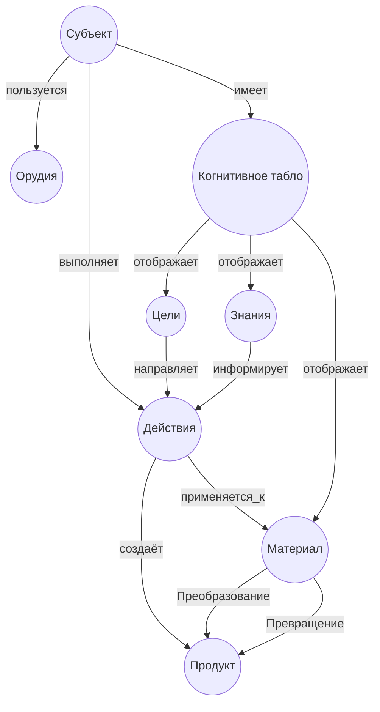

# Фреймворк акта деятельности

Этот фреймворк разворачивает **молекулу деятельности**, описанную Г.&nbsp;П.&nbsp;Щедровицким, в
структурированную модель. Акт деятельности рассматривается как
элементарная единица, из которой строятся цепи и сети действий. Важно,
что управленец работает **над деятельностями**, поэтому понимание
атомарного акта необходимо для проектирования и руководства.

## Основные элементы

В акта деятельности присутствуют несколько ключевых сущностей и
отношений:

- **Субъект** — носитель способностей и интериоризованных средств.
  Субъект обладает природными качествами и освоенными языками и
  методами (см. [[Мыслительные_категории#Мышление]]).
- **Цели** — ориентация, задающая направление преобразований. Могут
  наследоваться от более общего плана или формироваться в процессе
  деятельности.
- **Знания** — внешние или внутренние знания, которые субъект
  привлекает для решения задачи. Например, методики, теории,
  инструкции.
- **Орудия/средства** — как внутренние (языки, знаковые системы), так и
  внешние (машины, инструменты, техника). Их соединение с действиями
  приводит к появлению машин и механизмов.
- **Действия (d₁…dₖ)** — элементарные операции, которые совершает
  субъект при преобразовании материала. Совокупность действий
  образует процесс.
- **Исходный материал** — объект или ситуация, которые подлежат
  преобразованию.
- **Продукт** — результат преобразования; он может стать материалом,
  орудием или знанием для следующего акта деятельности.
- **Когнитивное табло** — внутренний «экран» сознания, на котором
  формируются образы целей, знаний и объекта. Субъект всегда
  воспринимает мир через выносящие отношения сознания.
- **Преобразование / превращение** — два вида связей между материалом
  и продуктом: физическое изменение и переход в другую форму (в том
  числе смысловую).

## YAML‑шаблон акта

Для кодирования конкретного акта в Obsidian можно использовать
YAML‑фронтматтер. Ниже — пример заполнения полей для одного акта
деятельности:

```yaml
---
type: ActOfActivity
subject:
  id: person_001
  abilities: ["оперативное мышление", "пространственное воображение"]
goals:
  - name: "Изготовить деталь"
    category: производственные
knowledge_sources:
  - "Инструкция по сварке"
  - "Алгебра логики"
tools:
  internal: ["язык алгебры", "координационная сетка"]
  external: ["сварочный аппарат", "станок ЧПУ"]
operations:
  - name: d1
    description: "Разметка материала"
  - name: d2
    description: "Сварка элементов"
material:
  id: material_001
  description: "Листовая сталь"
product:
  id: product_001
  description: "Металлическая рама"
transformation: true
metamorphosis: true
---
```

Это описание делает акт деятельности прозрачным для искусственных
агентов: каждое поле имеет ясное значение и может быть обработано
программно. Плагины Dataview и Bases позволяют агрегировать такие
записи и строить отчёты по целям, материалам или субъектам.

## Диаграмма связей

Следующая mermaid‑диаграмма визуализирует взаимосвязи между
компонентами акта. Узлы совпадают с элементами схемы, а дуги
отражают их отношения:



## Использование в рамках ОРУ

*Акт деятельности* — кирпичик, из которого организуются более сложные
структуры: цепочки операций, кооперативные связи, социотехнические
связки. Управленец работает не с отдельными предметами, а с
*деятельностями других людей*; поэтому важно уметь видеть и
анализировать такие «молекулы». Этот фреймворк позволяет кодировать
каждый акт и тем самым строить карту процессов в организации, выявлять
узкие места, прогнозировать изменения и проектировать новые схемы
деятельности.